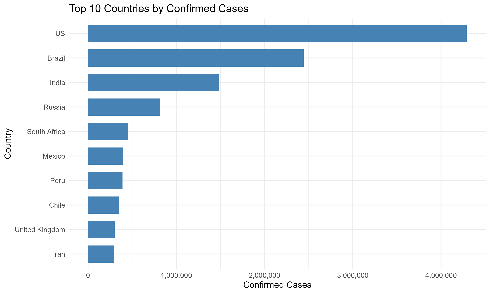
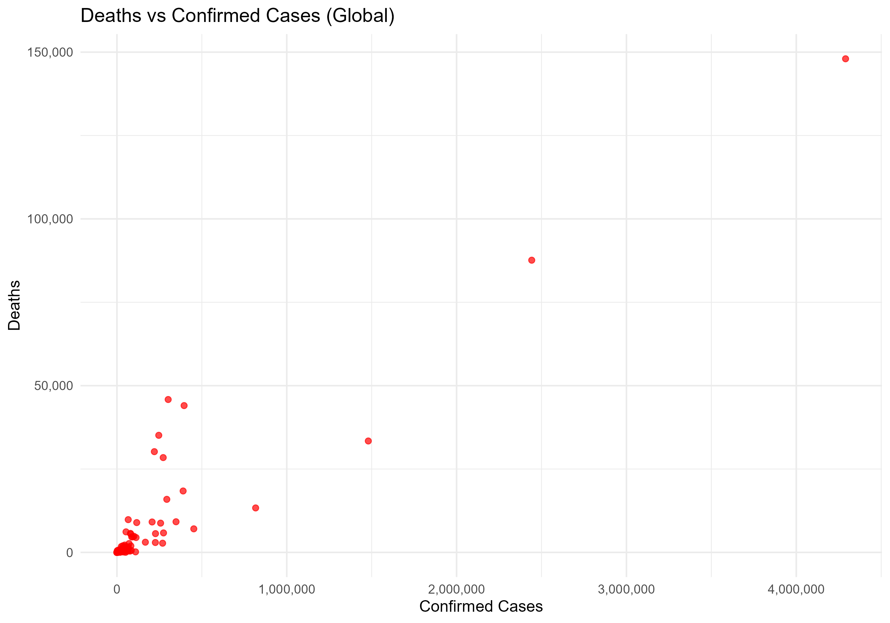
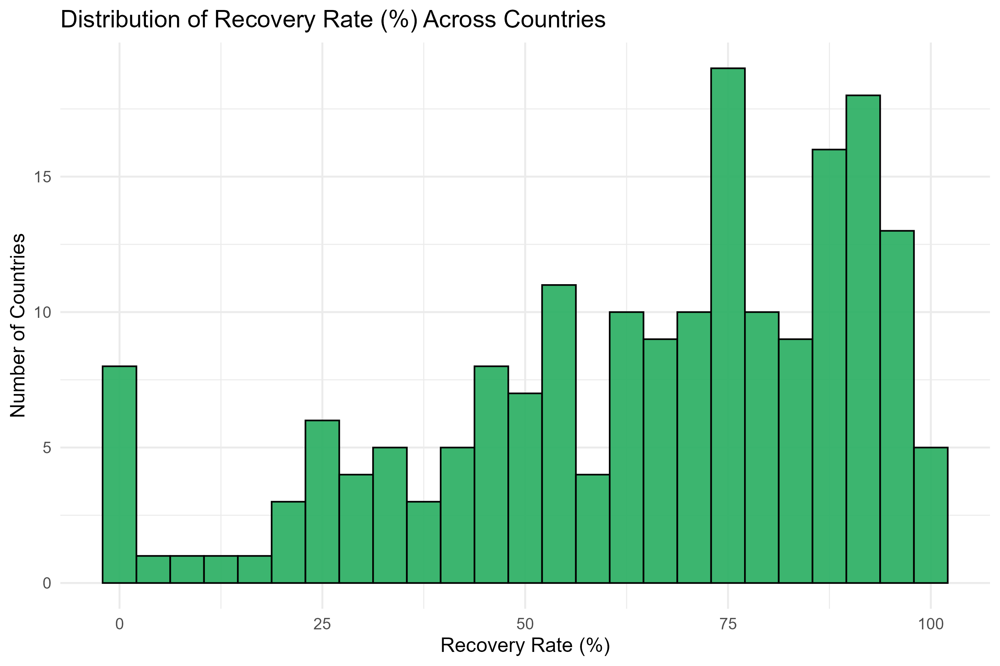
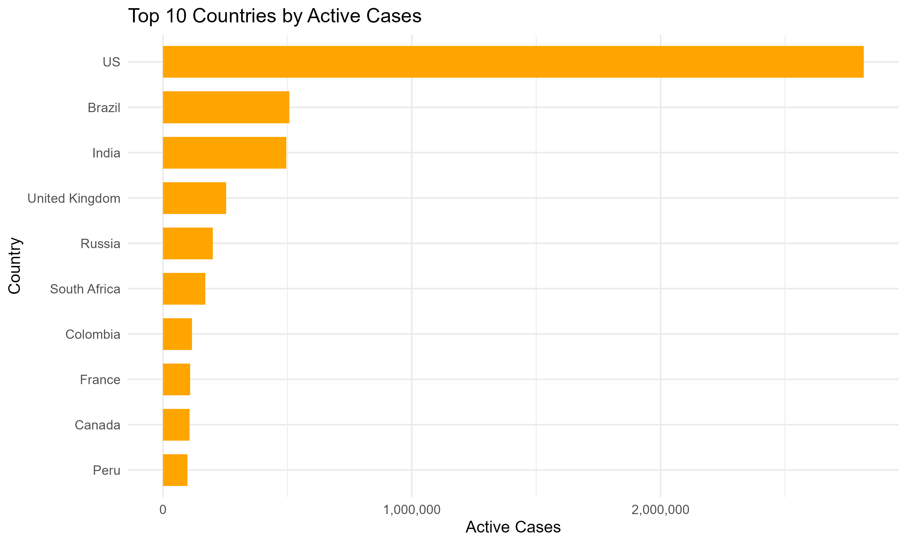
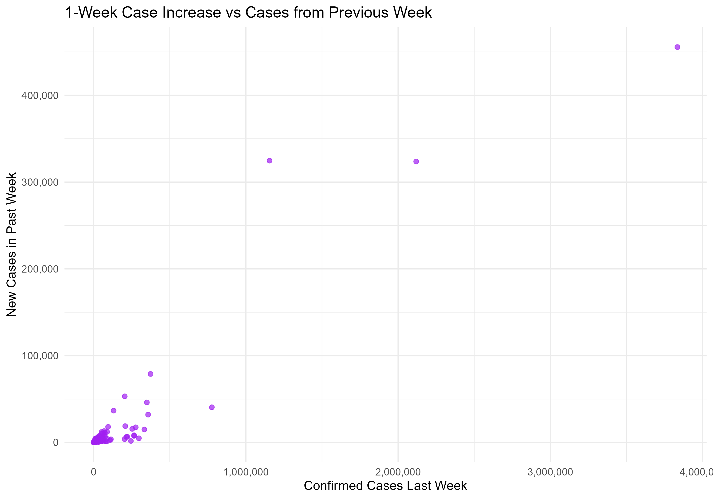

# Global Health Situation Analysis  

### 1. Top 10 Countries by Total Confirmed Cases

**Key Insight**  
The United States leads by a very large margin (>4.29 million cases), followed by Brazil (~2.44M) and India (~1.48M).  
These three countries alone accounted for roughly **50% of all global confirmed cases** at this point in time.  
The gap between the US and every other nation is striking — no other country even reached half of the US total.

---

### 2. Deaths vs Confirmed Cases (All Countries)

**Key Insight**  
There is a clear positive relationship, but with enormous variation in case fatality:
- European countries (UK, Italy, France, Belgium, Spain, Sweden) lie **well above** the main trend line → significantly higher mortality per case.
- Many Asian and Gulf countries (Singapore, Qatar, Bahrain, UAE) sit **far below** the trend → extremely low fatality despite substantial case numbers.
- The United States sits roughly on the global average trend at this stage.

This scatter plot visually demonstrates that testing capacity, healthcare system strength, demographics, and public health response dramatically influenced outcomes.

---

### 3. Distribution of Recovery Rates Across Countries

**Key Insight**  
The distribution is strongly **bimodal**:
- A large peak at **90–100%** recovery (common in Asia, Gulf states, and several African nations).
- A second peak at **0–30%** — caused by high-income countries (USA, UK, Sweden, Netherlands, etc.) that largely **stopped reporting recovered cases** (not low actual recovery).

Countries that maintained systematic recovery tracking showed that recovery rates above 90% were achievable even with large outbreaks.

---

### 4. Top 10 Countries by Active Cases

**Key Insight**  
At this exact moment, the United States had **2.82 million active cases** — more than the next nine countries combined.  
India (~495k) and Brazil (~508k) follow, but the scale difference is massive.  
This plot clearly identifies where transmission was still **uncontrolled and accelerating** in late July 2020 — overwhelmingly concentrated in the Americas and South Asia.

---

### 5. One-Week Case Increase vs Cases from Previous Week

**Key Insight**  
Countries in the top-right quadrant (high previous cases + high new cases) were in **full exponential growth**:
- India, Brazil, Colombia, Argentina, South Africa, Peru, Mexico dominate this zone.
- European countries and China appear lower on the vertical axis → growth had slowed significantly (many had already passed their peak).
- The plot cleanly separates nations that had controlled spread from those experiencing rapid escalation.

---

### Summary Table 

| WHO Region              | Share of Global Cases | Dominant Pattern                                    |
|-------------------------|-----------------------|-----------------------------------------------------|
| Americas                | ~51%                  | Epicenter of the outbreak; massive ongoing surge   |
| Europe                  | ~19%                  | High fatality, but most countries past peak       |
| South-East Asia         | ~13%                  | Rapid acceleration driven by India                |
| Eastern Mediterranean   | ~8%                   | Very low fatality in Gulf states                   |
| Africa                  | ~6%                   | Fast growth in South Africa and several others    |
| Western Pacific         | ~3%                   | Largely controlled (China, South Korea, Australia) |

---
*All visualizations created in R using ggplot2*